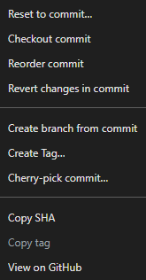

### Reset to commit...

* **Resetuj gałąź do tego commita.**
* Cofasz aktualną gałąź do wybranego commita, możesz wybrać tryb resetu: soft (zachowuje zmiany w staging), mixed (odstawia zmiany do unstaged), hard (usuwa zmiany całkowicie).

### Checkout commit

* **Przełącz się na ten commit w trybie detached HEAD.**
* Oznacza to, że "odwiedzisz" ten commit bez tworzenia nowej gałęzi. Możesz przeglądać kod, ale nie pracować na nim trwale, chyba że stworzysz branch.

### Reorder commit

* **Zmień kolejność commitów w historii (interaktywny rebase).**
* Możesz przeciągać i zmieniać kolejność commitów przed pushowaniem.

### Revert changes in commit

* **Stwórz nowy commit cofający zmiany w tym commicie.**
* Nie usuwa historii, tylko dodaje "odwrócenie" zmian z tego commita.

### Create branch from commit

* **Utwórz nową gałąź bazującą na tym commicie.**
* Przydatne, gdy chcesz zacząć pracę od tego punktu, tworząc nowy branch.

### Create Tag...

* **Dodaj tag do tego commita.**
* Tag to "etykieta" (np. v1.0) na konkretnym commicie, zwykle do oznaczania wersji.

### Cherry-pick commit...

* **Zastosuj zmiany z tego commita na innym branchu.**
* Pozwala wybrać pojedynczy commit i "przenieść" jego zmiany do aktualnej gałęzi.

### Copy SHA

* **Skopiuj hash SHA tego commita do schowka.**
* Przydatne do odwołań, skryptów, poleceń git.

### Copy tag

* **Skopiuj nazwę taga (jeśli commit jest otagowany).**

### View on GitHub

* **Otwórz stronę tego commita na GitHubie.**
* Wymaga, by repo było powiązane z GitHubem i dostęp do internetu.
