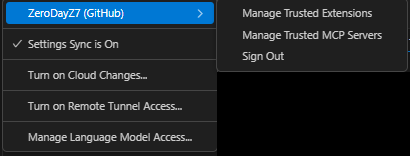

#### ▸ **Manage Trusted Extensions**

**Zarządzaj zaufanymi rozszerzeniami**
→ Lista rozszerzeń, którym nadałeś status "zaufanych", np. te mające dostęp do Twojego konta GitHub, API itd. Można tutaj cofnąć zaufanie lub dodać nowe.

#### ▸ **Manage Trusted MCP Servers**

**Zarządzaj zaufanymi serwerami MCP**
→ **MCP (Microsoft Control Plane)** – serwery Microsoftu, z którymi VS Code może się komunikować np. w przypadku **Live Share**, **Copilot**, **sync settings** itd.
Ta opcja pozwala zarządzać listą zaufanych serwerów (np. dopuszczać tylko znane adresy URL/API).

#### ▸ **Sign Out**

**Wyloguj się** z konta GitHub w VS Code.

---

### 🔹 **Settings Sync is On**

**Synchronizacja ustawień jest włączona**
→ Twoje ustawienia VS Code (np. motyw, skróty klawiszowe, rozszerzenia) są synchronizowane z chmurą GitHub/Microsoft. Dzięki temu możesz je łatwo odtworzyć na innym komputerze.

---

### 🔹 **Turn on Cloud Changes…**

**Włącz zmiany z chmury…**
→ Pobiera zmiany ustawień z konta w chmurze (jeśli były edytowane z innego komputera).

---

### 🔹 **Turn on Remote Tunnel Access…**

**Włącz dostęp przez zdalny tunel…**
→ Funkcja VS Code umożliwiająca **zdalne połączenie z innym komputerem przez tunel** (np. bez użycia VPN lub SSH bezpośrednio). Przydatne do pracy zdalnej np. na serwerze lub laptopie w domu.

---

### 🔹 **Manage Language Model Access…**

**Zarządzaj dostępem do modeli językowych…**
→ Dotyczy usług AI (jak GitHub Copilot, Copilot Chat). Pozwala kontrolować, które modele językowe mogą być wykorzystywane, gdzie wysyłane są dane itd.

---

## 🔍 Co to jest MCP Server?

* **MCP (Microsoft Control Plane)** to zestaw serwerów wykorzystywanych przez Microsoft do zarządzania usługami w chmurze: np. synchronizacją ustawień, Live Share, Copilot i innymi.
* Możesz „ufać” tylko określonym serwerom (np. `https://vscode.dev`), by zwiększyć bezpieczeństwo – szczególnie w środowiskach korporacyjnych lub gdy korzystasz z własnych serwerów proxy.